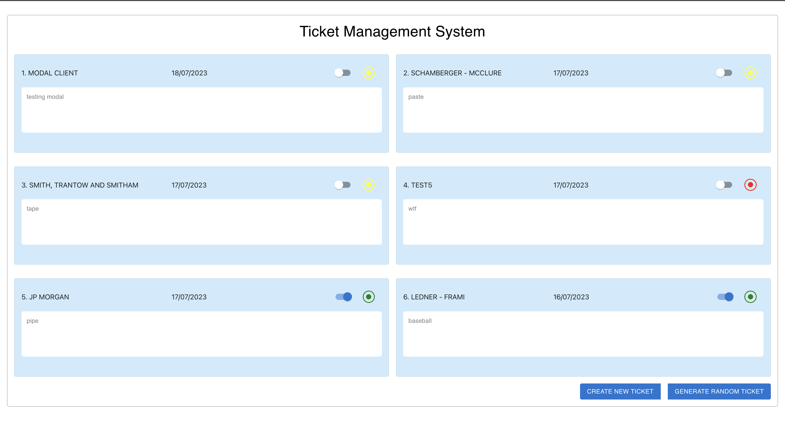
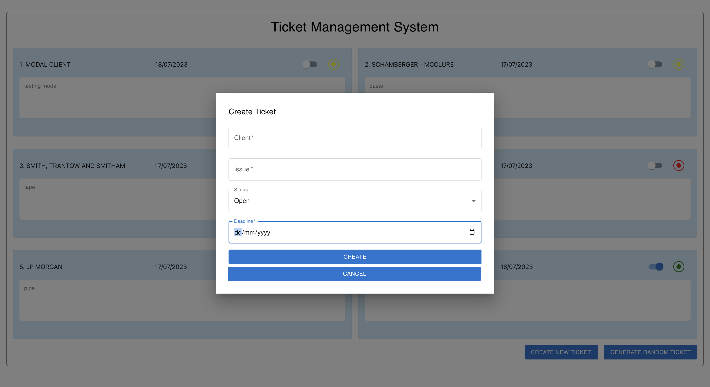

# Ticket Management System

The Ticket Management System is a web application that allows users to create and manage tickets for various issues.

## Features

- Use TypeScript, ReactJs, Material UI, and Styled Components to create the user interface.
- Display a list of tickets, including their client name, issue message, deadline, and status.
- The ticket status is represented by an icon with different colors based on the following conditions:
  - Green: status = closed
  - Yellow: status = open AND today < deadline
  - Red: status = open AND today > deadline
- Allow users to change the status of tickets using a slider button.
- Include a button that generates a random ticket with a client name, issue message, and deadline within a range of now - 2 days and now + 2 days. Save the generated ticket using the REST API every time the button is clicked.
  - Use Debounce to avoid concurrent generation of tickets.

## Technologies Used

- TypeScript: A statically typed superset of JavaScript.
- React: A JavaScript library for building user interfaces.
- Material-UI: A popular React UI framework for creating beautiful and responsive designs.
- Styled Components: A library for styling React components using CSS-in-JS.
- Cypress: A testing framework for end-to-end testing.

## Installation

1. Clone the repository:

   ```shell
   git clone https://github.com/kajal1106/IFD-challenge-frontend.git

2. Navigate to the project directory:
  ```shell
  cd IFD-challenge-frontend

3. Install the dependencies:
  ```shell
  npm install

4. Start the development server:
  ```shell
  npm start

5. Open your web browser and visit `http://localhost:8080` to access the application.


### Testing

1. The Ticket Management System uses Cypress for end-to-end testing. To run the tests, use the following command:
  ```shell
  npm run cypress:open

Cypress will open a test runner window where you can select and run the tests.


## API Endpoint Configuration
The frontend expects the backend API to be running at `http://localhost:3000`. Make sure to configure the backend accordingly.

## Docker Configuration
The backend includes a docker-compose.yml file and a Dockerfile for containerization. You can use Docker to run the backend in a containerized environment.

To run the backend using Docker:

1. Ensure that Docker is installed on your system.

2. Open a terminal and navigate to the project directory.

3. Run the following command to start the backend container:
  ```shell
   docker-compose up -d --build

4. Ensure no other application is running on your machine's port 8080. The frontend application will start and be exposed from port 8080. To run the app locally, you can go to your browser and paste http://localhost:8080

## UI Images

### Ticket List



### Create New Ticket


### TODO
1. Currently, the docker-compose templates are different for both frontend and backend. Create a docker-compose.yml file in the root directory.